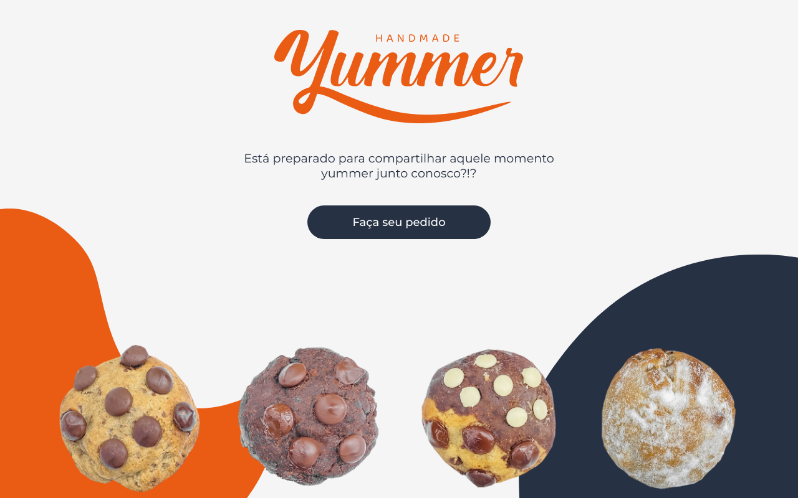

  <h1>🧡Yummer🧡</h1>
  <h2>Aplicação web de pedidos de cookies, rabanadas e sucos da Yummer!</h2>
  <h3>
    Demo:
    <a href="https://yummer.vercel.app">
      https://yummer.vercel.app
    </a>
  </h3>
  

## Sobre

Aplicação web que permite aos usuários adicionar produtos deliciosos ao carrinho e realizar pedidos pelo whatsapp para a doceria Yummer, residida em Brasília - DF.

Infelizmente a Yummer está com suas operações pausadas por tempo indeterminado, porém o demo da aplicação segue online para o público 🧡

## Tecnologias

- [Next.js][next]
- [Typescript][typescript]
- [Styled-components][styled]
- [react-icons][react_icons]
- [react-modal][react_modal]
- [react-loader-spinner][react_loader]
- [react-toastify][react_toastify]
- [react-cool-inview][react_cool_inview]
- [react-slick][react_slick]
- [react-player][react_player]

[next]: https://nextjs.org
[typescript]: https://www.typescriptlang.org
[styled]: https://styled-components.com
[react_icons]: https://react-icons.github.io/react-icons
[react_modal]: https://www.npmjs.com/package/react-modal
[react_loader]: https://www.npmjs.com/package/react-loader-spinner
[react_toastify]: https://fkhadra.github.io/react-toastify/introduction
[react_cool_inview]: https://github.com/wellyshen/react-cool-inview
[react_slick]: https://www.npmjs.com/package/react-slick
[react_player]: https://www.npmjs.com/package/react-player
